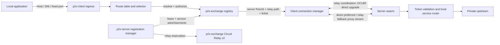

# Plan: P2P Proxy Tunnel Product Analysis and Architecture

- **Document status:** Stage 1 product analysis and approved architecture baseline
- **Date:** 2026-08-14
- **Audience:** product owner, system designer, Rust implementers, security reviewer, and test/operations engineers
- **Repository state:** new/empty Git repository; no implementation exists yet
- **Decision status:** the product decisions in §28 were approved on 2026-08-14
- **Next stage:** turn the decisions and work packages in this document into implementation-ready system-design documents and ADRs before production code is written

## 1. Executive Summary

P2X is a private-service access system made of exactly three executable Rust components:

1. `p2x-exchange` is publicly reachable. It authenticates peers, keeps leased server/service registrations, resolves client service selectors, issues short-lived connection authorization tickets, hosts a libp2p Circuit Relay v2 service, and coordinates direct connection upgrades.
2. `p2x-client` runs behind NAT/firewalls with no publicly configured endpoint. It exposes local HTTP, TLS-SNI, or explicitly bound TCP ingress, maps a configured domain/route to metadata, resolves the matching server through the exchange, and opens a stable tunnel to it.
3. `p2x-server` also runs behind NAT/firewalls. It continuously registers configured service advertisements, maintains exchange connectivity and relay reservations, accepts authorized P2P proxy streams, and connects each stream only to a locally configured upstream.

The recommended networking foundation is `rust-libp2p`, specifically authenticated peer identities, QUIC and TCP transports, Noise/TLS security, stream multiplexing, Circuit Relay v2, Identify, Ping, and DCUtR. The target server first creates a relay reservation at the exchange. A client can therefore always attempt an authorized relayed connection to the server. DCUtR uses that connection to coordinate a direct QUIC/TCP hole punch. Application data waits for a short direct-preference window; it uses the direct connection if available and uses the already prepared relay path only if direct establishment fails or exceeds the deadline.

This differs intentionally from the referenced `peer-gateway` project. That project contains valuable use cases, but it also demonstrates the cost of maintaining custom candidate exchange, NAT classification, punching, path arbitration, framing, encryption, and lifecycle code. The greenfield design should preserve its useful product concepts—domain-to-metadata routing, exact service registration, private upstreams, relay fallback, bounded concurrency, and strong observability—while delegating standard peer connectivity to libp2p wherever possible.

The approved v1 stability contract guarantees persistent registration, automatic control-plane reconnect, continuous relay reachability, bounded direct-to-relay fallback for new proxy streams, multiplexing, backpressure, keepalive, and recovery for subsequent connections. An active arbitrary TCP stream resets if its underlying P2P connection dies. Transparent active-stream migration is deferred because it requires a separate resumable logical-stream protocol with sequence/acknowledgement buffers.

## 2. Inputs and Evidence

### 2.1 Requested product constraints

- The system has three executable components: exchange, client, and server.
- All components are written in Rust.
- Exchange is public and accepts network connections from arbitrary internet locations.
- Client and server run in private networks with no operator-provisioned public endpoint.
- Server registers itself and its service mapping information with exchange.
- Client selects a service by domain, maps that domain to configured metadata, resolves a server, and establishes a P2P path.
- Exchange may relay data only when direct P2P cannot be established.
- Server acts as a reverse proxy to one or more private upstreams.
- Connectivity and long-running behavior must be stable enough for real service traffic rather than a smoke-test-only tunnel.

### 2.2 Current repository finding

`/Users/nanashi07/Projects/trio/p2x` is an empty Git repository with no commits, workspace manifest, source code, tests, configuration, or existing plan conventions. This document therefore defines a greenfield product baseline rather than modifying an existing implementation.

### 2.3 Reference project findings

The local reference at `/Users/nanashi07/Projects/trio/peer-gateway` already models:

- a public rendezvous/gateway;
- persistent server registration and heartbeat;
- direct UDP/TCP attempts and WebSocket relay fallback;
- client FQDN-to-metadata routing;
- an exchange-side service registry;
- server-local upstream configuration;
- encrypted frames, path selection, concurrency limits, metrics, and integration tests.

Confirmed lessons from its plans and implementation history:

1. A direct-only product cannot meet an availability requirement across arbitrary NATs. A real cross-internet run received no punch packets at either peer; relay must be the reliability floor.
2. NAT observations are hints, not proof. Stable observed ports do not prove endpoint-independent filtering, and UDP mappings cannot be inferred from TCP/WebSocket source ports.
3. Secondary observation endpoints are operational dependencies. Binding a second UDP port in the process is useless if the public firewall or advertised address is wrong.
4. Internet RTT and loss must influence all confirmation budgets. A 40 ms, single-packet confirmation caused a successfully punched WAN path to be discarded.
5. Client-visible success must be authoritative. A target-only success report cannot mark a session connected if the initiating client failed.
6. Container/VM networking can rewrite candidate addresses and break punching. Linux host networking is the most representative production/test topology; rootless or user-mode networking needs explicit warnings.
7. One server registration must handle many independent client streams. Session state, queues, timeouts, and cleanup need bounded per-session isolation.
8. A private upstream address must never be supplied by a client or published to exchange. Server-local configuration is the authority for actual destinations.
9. Control and bulk relay data must not share an unbounded queue or a single blocking actor.

These findings are product evidence, not a mandate to reuse the previous code.

### 2.4 External technical references

- `rust-libp2p` provides the Rust transport, security, multiplexing, NetworkBehaviour, relay, DCUtR, rendezvous, and NAT-related building blocks needed by this product.
- The official DCUtR example establishes an initial relayed connection, learns observed addresses, and attempts direct TCP/QUIC connectivity.
- Circuit Relay v2 provides identified, end-to-end encrypted relay connections and resource limits.
- AutoNAT can classify broad public/private reachability, but its result must not be treated as a per-address or permanent NAT truth.
- RustDesk demonstrates the operationally proven pattern of persistent rendezvous registration, direct-preferred connection setup, and a relay fallback. P2X currently uses RustDesk only for conceptual and behavioral research; this does not select AGPL as the P2X license. Do not copy, adapt, link, or import RustDesk source unless a concrete need is approved and the resulting license obligations are reviewed and declared first.

## 3. Product Definition

### 3.1 Problem statement

Organizations and developers often need to reach HTTP, TLS, database, or other TCP services that are inside private networks. Publishing those services through firewall rules or public load balancers increases operational work and attack surface. Traditional reverse tunnels solve reachability but route all bytes through a public server, increasing latency and relay cost even when the two peers could communicate directly.

P2X must provide a domain-oriented local access experience while preferring an authenticated direct peer connection. The public exchange supplies discovery and a guaranteed fallback path, but it is not the normal application data path when a direct route is usable.

### 3.2 Product promise

Given an authorized client route and an online server advertisement, P2X will:

1. resolve the exact intended private service without revealing its upstream address;
2. authenticate both peers and authorize the specific service access;
3. attempt a direct encrypted P2P path through NAT/firewalls;
4. fall back to an encrypted relay path within a bounded connection time;
5. proxy bytes with bounded memory, backpressure, half-close, cancellation, and observable failure reasons;
6. continuously restore server discoverability and reachability after transient control-plane loss.

### 3.3 Actors

| Actor | Need | Trust boundary |
| --- | --- | --- |
| Service operator | Expose selected private upstreams without opening inbound firewall ports | Controls `p2x-server`, its identity, and upstream configuration |
| Service consumer | Reach named services through a local domain or port | Controls `p2x-client` and route configuration |
| Exchange operator | Provide public discovery and fallback relay capacity | Operates metadata-bearing control plane and ciphertext relay; must not learn upstream addresses or plaintext |
| Local application | Use ordinary HTTP/TLS/TCP behavior | Does not need to understand P2P or exchange protocols |
| Untrusted internet peer | Can reach exchange sockets | Must not register, enumerate, reserve relay resources, or open upstreams without authorization |

### 3.4 Terminology

| Term | Meaning |
| --- | --- |
| Peer identity | Persistent libp2p identity key and derived `PeerId` used to authenticate a process instance |
| Exchange identity | Pinned public `PeerId` and signing public key trusted by clients and servers |
| Service advertisement | Public, non-secret service description registered by a server; never contains an upstream address |
| Selector | Tenant/namespace, service protocol class, and complete metadata map used for exact resolution |
| Route | Client-side mapping from a domain or local listener to one selector |
| Upstream | Server-local destination such as `127.0.0.1:8080`; never controlled by the client |
| Lease | Time-bounded service registration refreshed while a server is healthy |
| Relay reservation | Circuit Relay v2 reservation that makes a private server reachable through exchange |
| Connection ticket | Short-lived exchange-signed authorization binding client, server, service, and expiry |
| Peer connection | One libp2p connection over direct QUIC/TCP or circuit relay, multiplexing proxy substreams |
| Proxy stream | One authorized bidirectional application stream from a client ingress connection to one upstream connection |
| Direct-preference window | Short bounded interval in which data waits for DCUtR direct success before opening on relay |

## 4. Goals, Success Measures, and Non-Goals

### 4.1 Primary goals

- Exact, deterministic domain-to-service routing.
- No public inbound endpoint requirement for client or server.
- Direct QUIC/TCP preferred whenever validated and usable.
- Relay fallback available for all supported peers and committed within a bounded time.
- One online server can advertise multiple upstreams and accept many concurrent clients.
- One client can serve many domains and reuse peer connections safely.
- Exchange never needs private upstream addresses or application plaintext.
- Failures are classified well enough to distinguish configuration, authorization, registry, direct-connect, relay, upstream, and local ingress problems.
- Architecture uses standard libp2p protocols instead of reproducing custom NAT traversal and transport security.

### 4.2 Initial success measures

The approved launch target is a small, single-exchange deployment. Stage 2 may refine tuning values from measurements, but it must preserve the following validation baseline:

| Measure | Initial validation target |
| --- | --- |
| Server online discoverability | Registration becomes resolvable within 5 seconds after process/network availability |
| Relay fallback availability | A supported client reaches an online server through relay even when all direct traffic is blocked |
| Connection setup bound | Default direct-preference window 1.5 seconds; target p95 at most 5 seconds; configured user-visible hard deadline and p99 at most 20 seconds on a healthy exchange/network |
| Direct preference | Direct path selected whenever DCUtR succeeds before the configured direct deadline |
| Registration recovery | Server automatically reconnects, renews reservation, and re-registers without operator action; target recovery within 60 seconds after a healthy single exchange restarts |
| Initial workload | Up to 16 servers, 32 clients, 4 tenants, 16 services per server, 32 active peer connections, and 64 concurrent proxy streams |
| Validation headroom | Exercise 32 servers, 64 clients, 8 tenants, 32 services per server, 64 active peer connections, and 128 concurrent proxy streams; these are test targets, not hard product caps |
| Concurrency isolation | One slow stream does not block heartbeat, registration refresh, connection setup, or unrelated streams |
| Memory safety | Per-stream, per-peer, and exchange relay buffering remain under configured hard limits |
| Security | Unauthorized peers cannot resolve services, claim another server's service, or choose an arbitrary upstream |
| Diagnostics | Every failed ingress produces a stable public error code and a correlated trace/session identifier |

### 4.3 Non-goals for the first production increment

- Guaranteeing direct connectivity for every NAT/firewall topology.
- Peer discovery without the configured exchange.
- Anonymous peers or anonymous relay use.
- A general-purpose open forward proxy.
- Arbitrary client-supplied host/port dialing by server.
- UDP application/datagram proxying.
- Transparent L3 VPN or TUN/TAP networking.
- Wildcard/partial metadata matching, expression languages, or service mesh policy engines.
- Automatic public DNS management or automatic `/etc/hosts` changes.
- Automatically installing local certificate authorities.
- Multi-exchange consensus, global service replication, or active-active relay migration in the first increment.
- Transparent resumption of an already active arbitrary TCP stream after both direct and relay paths are lost, unless explicitly promoted to a launch requirement.

## 5. Product Assumptions and Hard Constraints

1. Client and server may bind local TCP/UDP sockets. “No public endpoint” means no public address or firewall rule is provisioned; NAT punching still requires local listeners.
2. Both peers can make outbound TCP connections to exchange. Direct QUIC additionally requires outbound UDP. TCP relay is the minimum reachability path.
3. Exchange has stable public DNS/IP, publicly reachable TCP, and preferably UDP/QUIC on the same numeric port.
4. Exchange is trusted for registration authorization, service resolution, metadata visibility, session authorization, availability, and traffic metadata. It is not trusted with application plaintext.
5. Client and server identities are persisted across restarts. Generating a new identity on every boot would break authorization, audit, and stable registry ownership.
6. Service selectors are not secrets. Do not place credentials, internal addresses, customer payloads, or sensitive free text in metadata.
7. Service upstream addresses and upstream TLS credentials remain only in server configuration.
8. The exchange can be single-instance during initial delivery. Its availability and scaling limitations must be explicit in health and deployment documentation.
9. Configuration is validated atomically before networking starts. Unknown fields are errors.
10. All network protocol messages are versioned and bounded before allocation or deserialization.
11. Initial enrollment uses a unique fixed high-entropy token per peer. Exchange configuration binds that token to the expected `PeerId`, tenant, role, scopes, and quotas.
12. Linux and macOS are supported. OCI containers are the primary packaging format; Linux is the reference environment for direct-connect validation, while macOS container runtimes add a VM/NAT layer and may rely on relay even when the native macOS process can connect directly.

## 6. Primary Use Cases

### 6.1 Register and keep a private server online

1. Operator starts `p2x-server` with a persisted identity, exchange trust pin, credentials, relay policy, and upstream definitions.
2. Server opens authenticated libp2p connectivity to exchange over QUIC or TCP.
3. Server requests/renews a Circuit Relay v2 reservation.
4. Server registers an atomic set of service advertisements with a finite lease.
5. Exchange verifies identity, role, tenant ownership, selector uniqueness, relay reachability, and limits.
6. Server refreshes its registration lease and monitors reservation renewal.
7. Readiness is true only while identity is loaded, configuration is valid, exchange control is connected, relay reservation is active, and service registration is current.
8. On disconnect, server reconnects with jittered exponential backoff. Existing healthy direct proxy streams are not killed merely because control connectivity is temporarily lost.

### 6.2 Resolve a domain and open a direct-preferred service stream

1. Local caller connects to `p2x-client` and presents a configured HTTP Host, TLS SNI, or fixed local listener.
2. Client canonicalizes the domain and performs an exact local route lookup. Unknown domains fail locally without contacting exchange.
3. Route produces a typed selector.
4. Client authenticates to exchange and requests an atomic resolve-and-authorize operation.
5. Exchange returns the server `PeerId`, relay multiaddress, capabilities, service identity/revision, expiry, and signed connection ticket.
6. Client establishes a relayed libp2p connection to the server through exchange. The server validates both peer identity and ticket before accepting application traffic.
7. DCUtR attempts a direct QUIC/TCP connection using the relayed connection as its coordination channel.
8. Client waits only for the configured direct-preference window. If a direct connection is validated, the proxy stream opens on it. Otherwise, the proxy stream opens on relay.
9. Server maps the ticket's service identity to its local upstream configuration and establishes that upstream connection.
10. Client, server, and upstream copy bytes bidirectionally with backpressure and half-close propagation.

### 6.3 Reuse connectivity for concurrent traffic

- A peer connection is pooled by target `PeerId` and transport/path class.
- Every local ingress connection receives a separate libp2p proxy substream and ticket validation.
- Multiple domains owned by the same server may share the same peer connection, but authorization remains per service/stream.
- Stream-level slowdown, failure, cancellation, and upstream timeout do not terminate unrelated streams.

### 6.4 Direct failure and relay fallback

- Direct failure includes explicit DCUtR error, no compatible direct transport, UDP blocking, NAT behavior that prevents punching, or deadline expiry.
- Relay is prepared before the direct attempt finishes, so fallback does not require a new discovery round trip.
- The fallback reason is recorded, but NAT classification is never used as the sole reason to skip an otherwise safe direct attempt.
- Relay usage is quota-controlled and observable by tenant, peer, connection, byte count, and duration.

### 6.5 Process or network restart

- Server loses its exchange connection: retry and re-register the full advertisement set atomically.
- Server loses relay reservation: mark readiness false, renew reservation, then refresh registration with the new relay address/revision.
- Client loses exchange connection: keep healthy peer streams; reconnect control for new resolutions.
- Direct peer connection dies: new streams race/re-establish direct and relay according to policy. Existing streams fail in v1 unless resumable logical streams are implemented.
- Exchange restarts: in-memory leases disappear; servers reconnect/re-register; clients invalidate failed cached mappings and resolve again.

## 7. Functional Requirements

### 7.1 Exchange requirements

| ID | Requirement |
| --- | --- |
| EX-001 | Listen publicly on authenticated libp2p TCP and QUIC transports; malformed or unauthenticated peers must be rejected before expensive work. |
| EX-002 | Persist its libp2p identity and ticket-signing key; peers pin the expected exchange identity. |
| EX-003 | Accept server registration only from credentials authorized for the server role and tenant. |
| EX-004 | Store an atomic leased advertisement set per server identity. A failed replacement must leave the previous valid set unchanged. |
| EX-005 | Resolve only exact typed selectors within the authenticated tenant/namespace. |
| EX-006 | Reject two live servers claiming the same selector until an explicit load-balancing policy exists. |
| EX-007 | Combine resolution and ticket issuance atomically so the ticket cannot refer to a stale or different registry owner. |
| EX-008 | Return only information needed to dial and authorize: server identity, relay/direct capability data, service reference, revision, expiry, and ticket. Never return the server's upstream address. |
| EX-009 | Run Circuit Relay v2 with hard reservation, circuit, duration, byte, concurrency, and per-peer limits. |
| EX-010 | Support the relayed connection required by DCUtR and keep control traffic isolated from relay forwarding work. |
| EX-011 | Expire registration records on lease timeout, identity disconnect policy, server revocation, or reservation loss. |
| EX-012 | Prevent registry enumeration unless a separately authorized operator API is added. Client API resolves one selector at a time. |
| EX-013 | Issue signed, short-lived, replay-resistant tickets bound to client `PeerId`, server `PeerId`, service ID/revision, tenant, timestamps, and nonce. |
| EX-014 | Expose operator health, readiness, metrics, and structured audit events without exposing secrets or payloads. |
| EX-015 | Drain gracefully: stop new reservations/resolutions, allow bounded existing circuits, then close. |

### 7.2 Client requirements

| ID | Requirement |
| --- | --- |
| CL-001 | Run as a long-lived daemon with persisted identity and an authenticated exchange connection. |
| CL-002 | Bind only configured local/LAN ingress addresses; default examples bind loopback. |
| CL-003 | Canonicalize and exact-match domains locally before contacting exchange. |
| CL-004 | Map every route to an explicit typed selector; do not derive arbitrary exchange queries from untrusted metadata. |
| CL-005 | Support request coalescing/singleflight so concurrent requests for one route do not create a resolve or dial storm. |
| CL-006 | Cache successful resolutions no longer than registry/ticket expiry and invalidate on authorization, stale revision, or connection failure. |
| CL-007 | Establish relay reachability first, run DCUtR, select a validated direct path within a bounded preference window, and fall back to relay. |
| CL-008 | Reuse peer connections while opening an independent proxy substream for each local ingress connection. |
| CL-009 | Enforce connect, header/SNI parse, idle, and overall setup timeouts. |
| CL-010 | Apply bounded buffers and propagate backpressure and TCP half-close. |
| CL-011 | Return protocol-appropriate local errors without leaking server IDs, internal upstreams, tickets, or registry content. |
| CL-012 | Preserve healthy peer streams across exchange control reconnect where libp2p permits it. |
| CL-013 | Expose route, resolution, path, stream, byte, latency, and error metrics with low-cardinality labels. |
| CL-014 | Reject unknown Host/SNI and host changes on an already route-bound connection. |

### 7.3 Server requirements

| ID | Requirement |
| --- | --- |
| SV-001 | Run as a long-lived daemon with persisted identity and no required public endpoint. |
| SV-002 | Establish and continuously renew at least one exchange relay reservation before advertising ready services. |
| SV-003 | Register all configured advertisements atomically and refresh their lease. |
| SV-004 | Advertise only service IDs, protocol classes, metadata, capabilities, and health; never upstream address or TLS secrets. |
| SV-005 | Accept proxy streams only from authenticated peers with a valid exchange ticket bound to the current client, server, service, tenant, revision, and time window. |
| SV-006 | Resolve the authorized service ID only through local immutable configuration; client messages cannot choose a host, port, URL, or Unix socket. |
| SV-007 | Connect to upstream using per-upstream connect/TLS/idle policy and fail closed. |
| SV-008 | Isolate each stream in a bounded task/actor and enforce global, per-client, per-service, and upstream connection limits. |
| SV-009 | Preserve healthy proxy streams during transient exchange control reconnect. |
| SV-010 | Stop accepting new streams before shutdown, drain for a bounded interval, withdraw registration, and release reservation. |
| SV-011 | Report readiness false when it cannot be reached through its advertised relay path. |
| SV-012 | Expose upstream health and proxy metrics without publishing upstream URLs in general logs or exchange labels. |

### 7.4 Shared protocol requirements

- Every P2X application protocol has a semantic version in its libp2p protocol ID, for example `/p2x/registry/1` and `/p2x/proxy/1`.
- All frames have hard encoded-size and decoded-field limits.
- Unknown optional fields/feature bits can be ignored only when the version contract allows it; incompatible mandatory capability mismatches fail explicitly.
- Network timestamps are validated with clock-skew tolerance; nonce/replay caches are bounded and time-expiring.
- Public error codes are stable, documented, and separate from internal error chains.
- Ticket signing bytes use a deterministic serialization defined by a test vector, not generic map serialization with unspecified order.

## 8. Domain, Selector, and Service Model

### 8.1 Recommended typed selector

```text
ServiceSelector {
  tenant: TenantId,
  protocol: http | tls_passthrough | tcp,
  metadata: sorted map<string, string>
}
```

The client route and server advertisement must normalize into identical values. Recommended rules:

- tenant comes from authenticated credentials, never from an untrusted request field;
- metadata contains 1–32 entries;
- keys match `^[a-z][a-z0-9_.-]{0,63}$`;
- values are trimmed UTF-8, 1–256 bytes, case-sensitive;
- total serialized selector size is capped, initially 4 KiB;
- reserved prefixes such as `p2x.` are rejected;
- exact equality includes protocol and the complete metadata set;
- a deterministic selector fingerprint is used for indexing/metrics, but the complete selector/service reference remains the authorization source.

Example:

```yaml
domain: orders.prod.p2x.local
target:
  protocol: http
  metadata:
    service: orders
    environment: production
    region: eu-west
```

### 8.2 Registration ownership

- One live `(tenant, selector)` has one owning server in v1.
- A server refresh/reconnect atomically replaces only its own advertisement set.
- Another server cannot claim the same selector until the prior lease is expired/revoked.
- Load balancing, priorities, weights, and replicas require an explicit later selection policy; they must not emerge from hash-map iteration order.

### 8.3 Domain canonicalization

- Lowercase ASCII representation after IDNA processing policy is defined.
- Strip one trailing dot and reject embedded ports in configured route names.
- Validate label and total DNS lengths.
- Exact routes only in v1. Wildcards create authorization and certificate ambiguity and are deferred.
- HTTP `Host`/`:authority` is normalized without changing path/query.
- TLS SNI must be present for an SNI listener; no-SNI connections fail unless the listener has an explicit single default route.
- Once a TCP connection is bound to a route, later HTTP requests on that connection may not switch to a different Host.

### 8.4 Private upstream model

```text
LocalUpstream {
  upstream_id,
  selector,
  connect_target,       // server-local only
  mode,                 // tcp bytes, HTTP origin, TLS origin, TLS passthrough
  connect_timeout,
  idle_timeout,
  tls_policy?,
  concurrency_limit
}
```

Exchange sees `upstream_id`, selector, protocol capability, and health/revision. It never sees `connect_target`, private DNS, origin credentials, CA bundle, or client certificates.

## 9. Ingress and Proxy Scope

### 9.1 Approved v1 adapters

The transport core should expose a generic ordered bidirectional byte stream. Ingress adapters determine a route, then hand the byte stream to the common tunnel layer.

1. **HTTP/1.1 Host routing**
   - Parse only bounded headers needed to determine Host and validate framing.
   - Preserve and forward the original request bytes after route selection, or use a full HTTP proxy only if header rewriting is a confirmed requirement.
   - Support streaming bodies and WebSocket upgrade naturally when forwarding bytes.
   - Lock the connection to its first selected route.

2. **TLS SNI passthrough**
   - Parse a bounded ClientHello without terminating TLS.
   - Select by SNI and forward the complete original byte sequence to a TLS-speaking upstream.
   - This preserves end-to-end TLS and naturally supports HTTP/2, gRPC, and other TLS protocols, but the upstream certificate must be valid for the caller's domain.

3. **Fixed local TCP listener**
   - A raw protocol has no domain field. Each configured bind address maps directly to a selector.
   - Suitable for databases, SSH-like services, and non-TLS protocols.

### 9.2 Deferred features

- TLS termination at client followed by plaintext or re-encrypted origin traffic.
- Full HTTP reverse-proxy semantics: `Forwarded` headers, hop-by-hop removal, retries, path prefix joins, HTTP/2 termination, gRPC trailers, and request-level pooling.
- HTTP CONNECT as a local explicit proxy.
- Server-initiated TLS to an upstream when the client-side ingress is plaintext.

The approved v1 implementation uses stream-level proxying because it is smaller, preserves protocol behavior, and aligns with libp2p substreams. If application-aware HTTP rewriting is later required, it must be a separate adapter above the same service resolution and peer connection layers.

## 10. Recommended Technical Architecture



### 10.1 Control plane

The control plane carries:

- peer authentication and capability negotiation;
- relay reservation lifecycle;
- server advertisement registration and refresh;
- exact client resolution;
- short-lived connection ticket issuance;
- revocation/version information;
- health, failure outcomes, and audit data.

Control messages are low-volume and bounded. No application payload is sent through registry protocols.

### 10.2 Connectivity plane

The connectivity plane is libp2p:

- public exchange listens on QUIC and TCP;
- private server holds a relay reservation;
- client dials server through `/p2p-circuit`;
- Identify supplies observed/listen addresses;
- DCUtR synchronizes direct TCP/QUIC attempts;
- Ping/connection events supply liveness signals;
- relay connection remains the fallback when direct upgrade cannot complete.

### 10.3 Application data plane

- Each ingress TCP connection maps to one `/p2x/proxy/1` substream.
- The opening request carries the signed ticket, ticket nonce/reference, requested service reference, protocol flags, and bounded optional trace context.
- Server validates before opening upstream.
- Server responds `accepted` only after upstream connection succeeds, then both sides copy bytes.
- Direct and relay connections are end-to-end authenticated/encrypted by libp2p. Ticket validation adds service authorization, not duplicate transport encryption.
- Backpressure comes from the asynchronous stream and bounded copy buffers; no unbounded message queue sits in between.

## 11. Why `rust-libp2p` Is the Recommended Base

### 11.1 Capabilities aligned with P2X

| Need | libp2p capability |
| --- | --- |
| Stable peer identity | Ed25519/secp256k1 identity and `PeerId` |
| Authenticated encrypted transport | Noise over TCP and TLS integrated with QUIC |
| Concurrent logical streams | Yamux for TCP; native QUIC streams |
| Observed addresses | Identify |
| Reachability assistance | Circuit Relay v2 reservations/circuits |
| Hole punching | DCUtR over an existing relayed connection |
| Broad NAT status hint | AutoNAT, if later needed |
| Liveness | Ping and swarm connection events |
| Application protocols | `NetworkBehaviour`, request-response, or custom connection handlers |

### 11.2 Important constraints

- DCUtR does not guarantee direct success; the relay path is essential.
- A relayed connection is established before DCUtR. To honor “relay only as fallback,” P2X may use relay for coordination while delaying application bytes until the direct deadline.
- A libp2p stream normally remains on the connection on which it was opened. Opening on relay and later obtaining direct connectivity does not automatically migrate that existing stream.
- When direct and relay connections to the same `PeerId` coexist, P2X must prove it can select the intended connection for a new proxy substream. This is a mandatory architecture spike before the proxy layer is finalized.
- AutoNAT is not a substitute for actual connection attempts and does not need to gate v1 path selection.
- Built-in libp2p rendezvous is useful for peer discovery, but P2X needs tenant-scoped exact metadata resolution and signed service tickets. A small custom registry protocol is clearer than encoding selectors into rendezvous namespaces.

### 11.3 Rejected primary alternatives

| Alternative | Reason not selected as the base |
| --- | --- |
| Copy custom traversal from `peer-gateway` | Proven complexity and instability in candidate observation, confirmation, path authority, framing, and lifecycle |
| WebRTC/ICE | Strong NAT traversal but adds SDP/ICE/data-channel concepts and integration complexity for a native Rust service; revisit only if libp2p matrix results are inadequate |
| Custom QUIC + STUN + TURN-like relay | Maximum control but recreates identity, candidate exchange, synchronization, relay, multiplexing, and security protocol work |
| TCP-only reverse tunnel | Reliable reachability but all application bytes use exchange; violates direct-preferred cost/latency goal |
| RustDesk protocol/code fork | Remote-desktop semantics do not match service registry/proxy needs, and importing its protocol stack would create unnecessary coupling and licensing obligations; use its behavior only as research unless a separately approved source-use and license decision is made first |

## 12. Component Architecture

### 12.1 `p2x-exchange`

Internal modules, not separate executables:

| Module | Responsibility |
| --- | --- |
| `identity` | Load persistent libp2p identity and ticket signing key; publish trust fingerprints |
| `swarm` | Build public TCP/QUIC transports and compose behaviours |
| `authn` | Map peer identity/credential to tenant, role, scopes, and limits |
| `registry` | Atomic leased advertisements and exact selector index |
| `ticket` | Deterministic claims, signing, expiry, nonce policy, key rotation |
| `relay` | Circuit Relay v2 configuration, admission, quotas, metrics, drain |
| `control` | Registry request protocol and version/capability negotiation |
| `revocation` | Reject revoked peers/tickets and advance authorization version |
| `admin` | Operator-only health/readiness/metrics; no public registry listing by default |

Exchange process invariants:

1. No registry entry exists without a live authorized server identity and current registration lease.
2. No ticket is issued unless selector resolution and server revision are checked in one transaction/critical section.
3. Relay admission is identity- and quota-aware.
4. Registry/control work never awaits relay socket copying while holding a global lock.
5. A ticket signing key is distinct from the libp2p transport identity and supports planned rotation.
6. Exchange can forward relay ciphertext without application protocol parsing.

### 12.2 `p2x-client`

| Module | Responsibility |
| --- | --- |
| `config` | Parse and fully validate routes, identity, trust, limits, and ingress |
| `ingress` | HTTP Host, TLS SNI, and fixed TCP adapters |
| `router` | Exact canonical-domain lookup to selector |
| `resolver` | Authenticated exchange resolve/authorize, cache, negative cache, singleflight |
| `swarm` | TCP/QUIC/relay client/DCUtR/Identify/Ping behaviours |
| `connection_manager` | Per-peer connection state, direct deadline, fallback, retries, pooling |
| `stream_opener` | Open `/p2x/proxy/1` on selected connection and perform ticket handshake |
| `copy` | Bidirectional bounded byte transfer and half-close |
| `supervisor` | Reconnect control, reap tasks, graceful shutdown, readiness |

Client connection states should be owned by one event-loop task around `Swarm`; other tasks communicate through bounded commands and one-shot replies. Do not share and lock `Swarm` across ingress tasks.

### 12.3 `p2x-server`

| Module | Responsibility |
| --- | --- |
| `config` | Validate identity, exchange, service advertisements, upstreams, and limits |
| `swarm` | TCP/QUIC/relay client/DCUtR/Identify/Ping and proxy stream listener |
| `reservation_manager` | Acquire, renew, and monitor exchange relay reservation |
| `registration_manager` | Register complete advertisement set and refresh lease |
| `ticket_validator` | Verify signature, binding, time, revision, nonce, and scopes |
| `service_router` | Map ticket-authorized service ID/revision to immutable local upstream |
| `upstream` | TCP/TLS/HTTP connection policy and health checks |
| `stream_actor` | Per-proxy-stream admission, upstream dial, copy, timeout, cancellation |
| `supervisor` | Backoff, readiness, draining, and task reaping |

Server readiness is deliberately stricter than process liveness. A running process without a current reservation and registration is alive but not ready.

## 13. Proposed Rust Workspace Boundaries

Exactly three binary packages are produced. Shared library crates do not violate the three-component requirement.

```text
Cargo.toml
crates/
  p2x-protocol/       # bounded wire types, tickets, selectors, error codes
  p2x-config/         # shared validated primitives and secret loading
  p2x-net/            # libp2p builder, behaviours, path/connection abstractions
  p2x-proxy/          # ingress parsing, stream handshake, bounded copy helpers
  p2x-observability/  # tracing/metrics conventions (optional if not worth a crate)
apps/
  p2x-exchange/       # binary
  p2x-client/         # binary
  p2x-server/         # binary
tests/
  integration/        # process/network fixtures and protocol compatibility
plan/
```

Boundary rules:

- Shared crates contain no component-specific global state.
- `p2x-protocol` has no Tokio/libp2p runtime dependency unless required by codec traits.
- Component state machines remain inside their owning app/library module, not in a “god” core crate.
- Network events are translated into small domain events at the `p2x-net` boundary.
- Do not create a fourth relay executable; relay behaviour is hosted by `p2x-exchange`.
- Pin the Rust toolchain, dependency versions, and minimum supported Rust version only after the connectivity spike confirms the chosen libp2p release.

## 14. Control Protocol and Data Model

### 14.1 Registration request

```text
RegisterServices {
  protocol_version,
  server_peer_id,
  instance_id,
  tenant,
  capabilities,
  relay_addresses[],
  services[] {
    upstream_id,
    selector,
    health,
    capacity_hint
  },
  requested_lease_seconds,
  idempotency_key
}
```

Rules:

- authenticated transport `PeerId` must equal `server_peer_id`;
- tenant and role come from exchange authorization, not the request;
- relay address must terminate in the registering server `PeerId` and use an allowed exchange relay;
- registration size/service count is bounded;
- replacement is all-or-nothing;
- response includes accepted revision and absolute expiry.

### 14.2 Resolve and authorize request

```text
ResolveService {
  protocol_version,
  client_peer_id,
  selector,
  client_capabilities,
  request_id
}
```

Response:

```text
ResolvedService {
  server_peer_id,
  upstream_id,
  selector_fingerprint,
  registration_revision,
  relay_addresses[],
  compatible_transports,
  ticket,
  expires_at,
  request_id
}
```

Resolution and ticket issuance are one operation. The exchange must not first return an owner and later issue a ticket after ownership might change.

### 14.3 Ticket claims

```text
ConnectionTicketClaims {
  version,
  issuer_exchange_id,
  tenant,
  client_peer_id,
  server_peer_id,
  upstream_id,
  selector_fingerprint,
  registration_revision,
  permissions: [open_proxy_stream],
  not_before,
  expires_at,
  ticket_id,
  max_streams
}
```

Recommended v1: one ticket authorizes one proxy stream (`max_streams = 1`). Connection pooling still works because tickets are per stream, not per transport connection. A later batched ticket can be introduced only with a bounded replay/use counter.

### 14.4 Proxy stream opening handshake

```text
Client -> Server: OpenProxyStream {
  version,
  ticket,
  upstream_id,
  registration_revision,
  ingress_kind,
  trace_id?
}

Server -> Client:
  Accepted { stream_id, selected_upstream_mode }
  or Rejected { public_error_code, retryable }

After Accepted: opaque bidirectional application bytes.
```

No application bytes are accepted before ticket and upstream validation. To reduce upstream resource abuse, server may validate and reserve a concurrency permit before dialing.

## 15. Connection and Path Lifecycle

### 15.1 Server startup state machine

```text
Starting
  -> IdentityReady
  -> ExchangeConnected
  -> RelayReserved
  -> Registered
  -> Ready

Any exchange/reservation/lease failure
  -> Degraded
  -> reconnect/renew/re-register
  -> Ready

Shutdown
  -> Draining
  -> RegistrationWithdrawn
  -> ReservationReleased
  -> Stopped
```

### 15.2 Client per-peer connection state machine

```text
Absent
  -> Resolving
  -> RelayDialing
  -> RelayReady
  -> DirectAttempting
  -> DirectReady | RelaySelected
  -> Active
  -> Degraded/Reconnecting
  -> Closed
```

Path policy:

1. Existing healthy direct connection wins immediately.
2. Otherwise establish/confirm relay connection to server.
3. Start/observe DCUtR direct upgrade.
4. Wait until direct succeeds or direct-preference deadline expires.
5. Open new proxy stream on direct when proven; otherwise open on relay.
6. Continue low-cost upgrade attempts only if libp2p behavior and resource policy support them.
7. New streams may switch to a newly available direct connection. Existing streams remain on their original connection in v1.

The deadline is configuration with a safe default, not scattered constants. Tune it from observed p50/p95 DCUtR timing and relay cost.

### 15.3 Proxy stream state machine

```text
IngressAccepted
  -> RouteResolved
  -> PeerReady
  -> Opening
  -> UpstreamConnecting
  -> Streaming
  -> HalfClosedLocal | HalfClosedRemote
  -> Closed

Any step -> Failed(public_code, internal_cause)
```

Cancellation must close both sides and release all permits exactly once.

The 20-second connection-setup timer starts when client ingress accepts a route-eligible connection and stops only when server returns `Accepted` after the upstream connection succeeds. Domain parsing, exchange resolution, ticket issuance, relay dialing, the direct-preference window, proxy-stream opening, ticket validation, and upstream dialing all share this one budget. Expiry cancels every losing task and returns `setup_timeout`; an implementation must not stack independent timeouts that can exceed the user-visible deadline.

## 16. Stability and Recovery Contract

### 16.1 Included in v1 stability

- Persistent server identity, reservation, registration, and refresh.
- Automatic reconnect with jittered exponential backoff.
- Multiplexed peer connections and independent proxy streams.
- TCP/QUIC keepalive and liveness via libp2p connection events/Ping.
- Direct-preferred path selection with bounded relay fallback.
- New-stream recovery after a direct connection fails.
- Preservation of healthy peer data connections during temporary exchange control loss.
- Bounded queues, backpressure, timeouts, task cancellation, and leak-free cleanup.
- Graceful component shutdown and bounded drain.

### 16.2 Not automatically included

If an active direct libp2p connection disappears, its substreams normally disappear. Reopening a new relay substream cannot transparently preserve the original caller/upstream TCP sequence state.

Transparent active-stream migration would require:

- stable logical connection and stream IDs independent of libp2p connections;
- per-direction byte sequence numbers and acknowledgements;
- bounded replay buffers and flow-control windows;
- duplicate suppression and ordered delivery;
- resume authentication and epoch negotiation;
- rules for bytes already delivered to local TCP sockets;
- timeout/overflow behavior;
- extensive chaos and compatibility testing.

Recommendation: ship v1 with explicit active-stream reset semantics and fast recovery for new connections. Add resumable streams only when concrete use cases require them and memory/correctness costs are accepted.

## 17. Security Architecture

### 17.1 Trust model

- Peer transport identity authenticates which process is connected.
- A unique fixed token bound to the authenticated `PeerId` authorizes tenant, role, selector ownership, resolution, and relay quota.
- Exchange-signed tickets authorize one client-to-server service stream.
- Server-local configuration authorizes the actual upstream destination.
- Libp2p encryption protects direct and relayed application bytes from passive observers and the relay.
- Exchange still observes identities, selector queries/registrations, timing, connection metadata, and relay byte volume.

### 17.2 Required controls

1. Persist peer private keys with restrictive permissions or load them from an approved secret store.
2. Pin exchange `PeerId`; do not trust arbitrary DNS-delivered identities without a rotation mechanism.
3. Separate exchange transport identity from ticket signing keys.
4. Support ticket key IDs and overlapping verification windows for rotation.
5. Bind all ticket fields listed in §14.3 and enforce clock skew/expiry.
6. Keep a bounded replay cache for one-use ticket IDs, scoped by expiry.
7. Generate a separate high-entropy fixed token for every peer; never share one token across client/server instances or tenants.
8. Store only token digests where practical, compare credentials in constant time, bind a valid token to the transport `PeerId`, and define token rotation/revocation without silently changing identity.
9. Authenticate before registry lookup details or relay reservation allocation.
10. Apply per-source/IP pre-auth connection limits and per-identity post-auth quotas.
11. Never accept a client-supplied upstream address, SNI rewrite target, URL, or DNS name at server.
12. Validate DNS/metadata Unicode and length to avoid canonicalization confusion.
13. Redact credentials, private keys, tickets, raw selectors when sensitive, payload, and upstream addresses from logs.
14. Restrict metrics/admin listeners to operator networks or separate authentication.
15. Treat relay as non-anonymous: all participants and exchange know peer IDs.
16. Define credential revocation behavior for existing registrations, tickets, circuits, and streams.
17. Run dependency-license, source-provenance, and advisory checks in CI; add AGPL compliance checks only if AGPL-covered source is later approved for use.

### 17.3 Threats to cover in Stage 2

- exchange connection flood and expensive handshake exhaustion;
- relay bandwidth theft and long-lived idle circuits;
- service registration takeover;
- selector probing/enumeration;
- ticket replay or cross-peer use;
- stale registration revision use after service replacement;
- upstream SSRF/arbitrary dialing;
- oversized/malformed protocol frames and TLS ClientHello/header bombs;
- slowloris ingress and slow reader/writer relay behavior;
- DNS rebinding at server-local upstream resolution;
- peer key theft and exchange signing-key compromise;
- correlation/privacy leakage through metadata and relay traffic analysis.

## 18. Concurrency, Backpressure, and Resource Ownership

### 18.1 Ownership model

- One component event loop owns each libp2p `Swarm`.
- Bounded command channels connect ingress/control tasks to the swarm event loop.
- Registry state uses short critical sections; no socket I/O occurs while holding registry locks.
- Every accepted proxy stream owns one cancellation scope, upstream connection, permits, timers, and byte counters.
- Parent supervisors track all spawned tasks and reap them on terminal events.

### 18.2 Required limits

Stage 2 must select defaults and hard maximums for:

- pre-auth exchange connections per IP;
- authenticated connections per peer/tenant;
- relay reservations per peer;
- relay circuits per peer/tenant/global;
- relay bytes per second and total per circuit;
- circuit duration and idle timeout;
- advertisements per server and metadata bytes;
- resolve requests per client;
- pooled peer connections per server;
- concurrent proxy streams per client/server/service;
- concurrent upstream dials;
- ingress header/ClientHello bytes and parse time;
- per-direction copy buffer;
- shutdown drain time;
- replay-cache entries.

Limits must reject early with stable error codes and metrics. “Queue until memory is exhausted” is never a valid overload policy.

## 19. Failure and Error Model

### 19.1 Public error categories

| Code family | Examples | Retry guidance |
| --- | --- | --- |
| `route.*` | unknown domain, missing Host/SNI, route mismatch | configuration/client error; do not retry blindly |
| `auth.*` | peer unauthorized, ticket invalid/expired/replayed | refresh credentials/ticket; security audit |
| `registry.*` | service not found, offline, conflict, stale revision | short bounded retry only for offline/stale |
| `exchange.*` | unavailable, protocol mismatch, overloaded | retry with backoff |
| `relay.*` | reservation missing, quota, dial failure | server/operator action or backoff |
| `direct.*` | DCUtR timeout/failure/no compatible transport | expected fallback condition, not necessarily user-visible failure |
| `peer.*` | server connection lost, capability mismatch, stream rejected | re-resolve/reconnect if retryable |
| `upstream.*` | connect timeout, refused, TLS failure, idle timeout | service operator action; optional bounded retry before bytes sent |
| `limit.*` | concurrency, size, rate, queue saturation | retry after delay or reduce load |
| `protocol.*` | malformed frame, unsupported version | do not retry; possible security event |

### 19.2 Error mapping at ingress

- HTTP-aware adapter can return 400 for malformed/missing Host, 404 for unknown local route, 401/403 for authorization, 502 for upstream failure, 503 for offline/exchange/overload, and 504 for setup timeout.
- TLS passthrough and raw TCP cannot reliably return HTTP errors; close/reset and emit a correlated local diagnostic.
- Internal causes retain source chains in structured logs but public responses contain stable codes and trace IDs only.

## 20. Configuration Model

All examples are illustrative Stage 1 schemas. Stage 2 must finalize field names and full validation.

### 20.1 Exchange example

```yaml
schema_version: 1
identity:
  key_file: /var/lib/p2x/exchange.key
ticket_signing:
  key_file: /var/lib/p2x/ticket-signing.key
listen:
  - /ip4/0.0.0.0/tcp/7000
  - /ip4/0.0.0.0/udp/7000/quic-v1
advertise:
  - /dns4/exchange.example.com/tcp/7000
  - /dns4/exchange.example.com/udp/7000/quic-v1
registry:
  lease_seconds: 30
  max_services_per_server: 128
relay:
  enabled: true
  max_reservations: 10000
  max_circuits: 20000
  max_circuit_duration_seconds: 3600
  max_circuit_bytes: 1073741824
admin:
  bind: 127.0.0.1:9090
auth:
  provider: fixed_token_file
  fixed_token_file: /etc/p2x/peers.yaml
```

### 20.2 Server example

```yaml
schema_version: 1
identity:
  key_file: /var/lib/p2x/server.key
exchange:
  peer_id: 12D3KooW...
  addresses:
    - /dns4/exchange.example.com/tcp/7000/p2p/12D3KooW...
    - /dns4/exchange.example.com/udp/7000/quic-v1/p2p/12D3KooW...
  credential_env: P2X_SERVER_TOKEN
registration:
  lease_seconds: 30
  refresh_seconds: 10
network:
  listen:
    - /ip4/0.0.0.0/tcp/0
    - /ip4/0.0.0.0/udp/0/quic-v1
limits:
  max_proxy_streams: 256
  max_streams_per_client: 32
upstreams:
  - id: orders-production
    selector:
      protocol: http
      metadata:
        service: orders
        environment: production
        region: eu-west
    connect: 127.0.0.1:8080
    connect_timeout_ms: 3000
    idle_timeout_ms: 60000
  - id: postgres-production
    selector:
      protocol: tcp
      metadata:
        service: postgres
        environment: production
        region: eu-west
    connect: 127.0.0.1:5432
    connect_timeout_ms: 3000
    idle_timeout_ms: 300000
```

### 20.3 Client example

```yaml
schema_version: 1
identity:
  key_file: /var/lib/p2x/client.key
exchange:
  peer_id: 12D3KooW...
  addresses:
    - /dns4/exchange.example.com/tcp/7000/p2p/12D3KooW...
    - /dns4/exchange.example.com/udp/7000/quic-v1/p2p/12D3KooW...
  credential_env: P2X_CLIENT_TOKEN
network:
  listen:
    - /ip4/0.0.0.0/tcp/0
    - /ip4/0.0.0.0/udp/0/quic-v1
  direct_preference_ms: 1500
  connection_setup_timeout_ms: 20000
ingress:
  http:
    bind: 127.0.0.1:8080
  tls_sni:
    bind: 127.0.0.1:8443
routes:
  - domain: orders.prod.p2x.local
    ingress: http
    target:
      protocol: http
      metadata:
        service: orders
        environment: production
        region: eu-west
  - domain: secure.prod.p2x.local
    ingress: tls_sni
    target:
      protocol: tls_passthrough
      metadata:
        service: secure-api
        environment: production
raw_tcp:
  - name: postgres
    bind: 127.0.0.1:15432
    target:
      protocol: tcp
      metadata:
        service: postgres
        environment: production
        region: eu-west
limits:
  max_ingress_connections: 512
  max_streams_per_server: 128
```

### 20.4 Configuration rules

- YAML uses `schema_version` and denies unknown fields.
- Validate every error in one pass before binding or connecting.
- Secret values come from environment/secret files, not normal YAML examples.
- Explicit config path missing/unreadable is fatal.
- Identity key missing may generate only when an explicit `generate_if_missing` onboarding mode is enabled; never silently replace a missing production key.
- Durations, sizes, counts, addresses, selectors, duplicate routes, duplicate upstream IDs, and secret references are validated.
- Log the effective non-secret configuration and a hash/revision, never secret contents.
- Dynamic reload is deferred until an atomic ownership and rollback design exists.

## 21. Observability and Operations

### 21.1 Correlation identifiers

Use distinct identifiers for:

- registry request;
- registration revision;
- ticket ID (hashed/truncated in logs);
- peer connection;
- DCUtR attempt;
- proxy stream;
- local ingress trace.

Avoid treating socket address as identity.

### 21.2 Minimum metrics

Exchange:

- authenticated/failed connections;
- current registrations and expiry/removal count;
- resolve outcomes and latency;
- issued/rejected/replayed tickets;
- relay reservations/circuits current and total;
- relay bytes/duration/quota rejects;
- direct-upgrade outcomes reported by peers;
- event-loop lag, task count, file descriptors, memory, queue saturation.

Client:

- ingress connections by adapter and route fingerprint;
- local route misses;
- resolve/cache outcomes and latency;
- relay dial and DCUtR success/failure/timing;
- selected path for new streams;
- active peer connections and proxy streams;
- bytes, duration, upstream/server rejection codes;
- reconnect/backoff and task/queue saturation.

Server:

- exchange connection, reservation, registration lease/revision, readiness;
- accepted/rejected tickets and replay/stale revision failures;
- active streams by service fingerprint;
- upstream dial outcomes/latency;
- bytes/duration/idle timeout;
- capacity rejects, reconnects, and task/queue saturation.

### 21.3 Logging/privacy rules

- Structured logs with component, peer hash/ID policy, request/stream IDs, state transition, path, duration, and stable error code.
- Never log credentials, private keys, full tickets, application payloads, authorization headers, cookies, or private key material.
- Upstream addresses appear only in protected server-local diagnostic logs at an explicitly enabled level.
- Selector metadata may be sensitive operational information; default metrics use a fingerprint and logs use an allowlisted/redacted representation.

### 21.4 Health endpoints

- `live`: runtime/event loop functioning.
- `ready`: component-specific required dependencies available.
- `p2x-exchange` readiness includes listeners, signing key, auth source, and relay admission state.
- `p2x-client` readiness includes valid config, ingress bound, identity loaded, and exchange reachability for new resolutions.
- `p2x-server` readiness includes active exchange control, relay reservation, and current registration lease.

## 22. Deployment Architecture

### 22.1 Initial topology

- One public `p2x-exchange` instance on one host or VM. Active-active exchange is not part of v1.
- Public TCP and UDP/QUIC port 7000 (illustrative), with correct DNS and firewall rules.
- Operator-only metrics/health listener or protected reverse proxy.
- Publish OCI images for Linux and document container-first deployment for all three components.
- Linux containers are the reference production and CI environment. Use host networking for client/server direct-connect validation where security policy permits; bridge/rootless networking is separately tested and may reduce direct success.
- Support native macOS client/server binaries. Also support common macOS container runtimes for functional and relay operation, but document that Docker Desktop/Colima-style VM networking adds another NAT layer and cannot promise the same direct-connect rate as native macOS or Linux host networking.
- Persist component identity keys and fixed-token configuration/secret references on durable, restrictively permissioned volumes.
- Exchange registry may be in memory in v1; servers repopulate after restart.

### 22.2 Scaling constraints

A single exchange couples registry and relay availability. Horizontal scaling is not “just add replicas” because:

- server reservations are held by a specific relay instance;
- clients need the correct relay multiaddress;
- registry/ticket signing state must be consistent;
- existing relay circuits cannot move between processes;
- connection affinity and graceful drain matter.

Stage 2 must document the approved single-instance launch boundary. A later multi-exchange design can let servers reserve/register with multiple independent exchanges and clients choose one, avoiding shared live relay state. Do not add distributed consensus before availability requirements justify it.

## 23. Verification Strategy

### 23.1 Mandatory architecture spikes before feature implementation

1. **DCUtR + relay baseline:** run official-style relay/server/client peers on TCP and QUIC; prove relay works when direct is blocked and direct succeeds in a supported NAT topology.
2. **Connection selection:** keep simultaneous direct and relayed connections to one `PeerId`; prove P2X can open a new application substream on the intended direct `ConnectionId`, with relay selected only by policy.
3. **Direct deadline:** measure event ordering and failure events so fallback cannot hang on an absent DCUtR terminal event.
4. **Control loss:** drop client/server-to-exchange control while a direct stream runs; prove healthy direct traffic continues.
5. **Relay limits:** verify Circuit Relay v2 resource-limit configuration and observable rejection behavior.
6. **Half-close/backpressure:** proxy a large bidirectional TCP stream through both direct and relay with a slow reader and bounded memory.

Failure of spike 2 is an architecture gate. If rust-libp2p cannot reliably target the selected connection without a custom `NetworkBehaviour`/handler, Stage 2 must design that handler before ingress/proxy implementation.

### 23.2 Unit tests

- selector/domain normalization and exact equality;
- configuration aggregation and all validation errors;
- registry atomic replacement, conflicts, expiry, and revocation;
- deterministic ticket serialization/signature test vectors;
- ticket binding, expiry, skew, replay, revision, and wrong-peer rejection;
- client cache TTL/invalidation/singleflight;
- path state-machine races, deadlines, cancellation, and stale events;
- bounded HTTP Host and ClientHello SNI parsing;
- upstream router never accepts client-supplied destinations;
- public error mapping and secret redaction.

### 23.3 Integration tests

- server register/refresh/disconnect/reconnect/replace advertisement set;
- client exact resolve and signed ticket issuance;
- unknown/offline/conflicting selector behavior;
- authorized proxy stream to configured upstream;
- unauthorized/replayed/stale/wrong-service ticket rejection;
- many simultaneous streams over one peer connection;
- slow stream isolation and global/per-service capacity;
- graceful shutdown and relay drain;
- exchange restart followed by server re-registration and client recovery.

### 23.4 Network topology matrix

| Topology | Expected result |
| --- | --- |
| Same host/process namespace | direct succeeds; relay available for forced test |
| Same LAN | direct TCP/QUIC preferred |
| Different NATs with UDP allowed | direct QUIC attempted; relay fallback guaranteed |
| UDP blocked, outbound TCP allowed | direct TCP attempted where possible; TCP relay works |
| Symmetric/endpoint-dependent NAT | direct may fail; relay meets connection bound |
| Same public IP with no hairpin | direct may fail; relay works |
| IPv6-capable peers | direct IPv6 preferred when validated |
| Double NAT/CGNAT | direct best effort; relay works |
| Rootless/user-mode container network | classified/warned; no false direct success requirement |
| Linux OCI container with host networking | direct and relay behavior must match the native Linux reference within measurement tolerance |
| Native macOS client/server | direct and relay paths are supported and included in release testing |
| macOS VM-backed container runtime | registration, resolution, and relay are required; direct remains best effort and its observed limitations are documented |
| Exchange UDP blocked | TCP exchange/relay still works; QUIC direct opportunity reduced |
| High RTT/loss/reordering | no fixed LAN-only confirmation timeout; bounded fallback |

Use Linux network namespaces, firewall rules, and traffic shaping for reproducible CI cases; complement them with at least two real-machine/internet tests because simulated NAT does not cover every device behavior.

### 23.5 Soak and load tests

- validate the initial workload and 2x headroom envelopes from §4.2;
- thousands of registry refresh/expiry cycles with no stale owner;
- repeated 100+ connect/disconnect iterations under direct/relay mix;
- multi-hour runs at 64 concurrent proxy streams, plus a 128-stream headroom run, with packet loss and exchange reconnect;
- relay bandwidth saturation without control-plane starvation;
- measure relay throughput/bytes/duration by upstream class rather than declaring an unverified fixed bandwidth SLO;
- slowloris headers/ClientHello and slow relay receivers;
- process memory, task count, file descriptors, queues, and replay cache return to baseline after cleanup.

## 24. Delivery Breakdown

This is a dependency-ordered product breakdown, not yet a coding plan. Each phase requires a Stage 2 design with concrete files, APIs, state ownership, and tests.

### Phase 0 — Decisions, workspace, and connectivity proof

- Record the approved decisions in §28 as ADR constraints for libp2p, fixed-token authentication, proxy scope, stream recovery, single-instance exchange, the currently undecided repository license, conditional third-party source compliance, and platform support.
- Bootstrap Rust workspace with three binaries and shared crates.
- Pin toolchain, lint/format/test/security/license CI.
- Complete all architecture spikes in §23.1.
- Produce a repeatable three-process local lab and two-host NAT test runbook.

**Exit:** connection/path selection is proven; relay fallback and intended direct selection are observable and bounded.

### Phase 1 — Identity, authentication, and bounded protocols

- Persist component identities and pin exchange identity.
- Implement the fixed-token credential provider: one token per peer, token-to-`PeerId`/tenant/role/scope binding, digest-safe storage, constant-time validation, and rotation/revocation behavior.
- Implement bounded versioned codecs and public error types.
- Define deterministic ticket claims/signatures/test vectors and key rotation fields.
- Add secret-redaction tests.

**Exit:** authenticated client/server/exchange peers can exchange a bounded ping/control request; invalid identities/credentials fail closed.

### Phase 2 — Exchange registry and server availability

- Implement atomic leased service registry and exact selector index.
- Implement register/refresh/withdraw and conflict behavior.
- Configure relay service admission and hard limits.
- Implement server relay reservation and registration supervisors.
- Implement readiness and reconnect/re-registration.

**Exit:** an online private server remains resolvable and relay-reachable; expiry/disconnect/restart removes or restores it correctly.

### Phase 3 — Resolution, tickets, and peer connection manager

- Implement atomic resolve-and-authorize.
- Implement client resolver, cache, invalidation, and singleflight.
- Implement client relayed dial, DCUtR direct deadline, explicit connection selection, and pooling.
- Implement server ticket validation and replay defense.

**Exit:** client obtains a one-use ticket and opens an authenticated empty proxy substream over direct when possible or relay otherwise.

### Phase 4 — Raw proxy tunnel

- Implement server-local service router and TCP upstream connector.
- Implement proxy opening handshake and response codes.
- Implement bounded bidirectional copy, half-close, idle timeout, cancellation, and permits.
- Add fixed local TCP ingress first because it avoids HTTP/TLS routing ambiguity.

**Exit:** raw TCP service works end-to-end over forced direct and forced relay, including large streams, slow consumers, and concurrent sessions.

### Phase 5 — Domain ingress adapters

- Implement exact domain router.
- Add bounded HTTP Host ingress and connection route locking.
- Add bounded TLS ClientHello/SNI passthrough.
- Map protocol-appropriate errors and preserve original byte streams.
- Document local DNS and certificate/upstream requirements.

**Exit:** configured domains reach only their exact selector; unknown/malformed/cross-route traffic fails locally.

### Phase 6 — Resilience, observability, and operations

- Complete metrics, traces, audit logs, dashboards, and runbooks.
- Add all network matrix, chaos, load, and soak cases.
- Tune deadlines/limits from measurements.
- Implement graceful drain and exchange/server/client restart recovery.
- Conduct security and license review.

**Exit:** acceptance criteria and launch SLOs pass under the declared single-exchange deployment boundary.

### Optional Phase 7 — Active logical-stream resumption

- Only enter after an approved resumable-stream protocol design and memory budget.
- Add logical stream sequence/ack/replay/epoch/resume protocol.
- Prove no duplication, corruption, reordering, unbounded buffering, or cross-ticket resume.

**Exit:** selected supported applications survive direct-to-relay path replacement without replacing their local TCP connection, within declared buffer and outage limits.

## 25. Stage 2 System-Design Work Packages

The next planning stage should produce the following numbered documents. Each must be implementation-ready and cross-reference the relevant requirements in this document.

1. `plan/01-connectivity-spike-and-libp2p-design.md`
   - exact rust-libp2p version/features;
   - swarm composition for all components;
   - relay reservation and DCUtR events;
   - direct/relay `ConnectionId` selection mechanics;
   - timeout/race state machines and spike results.
2. `plan/02-identity-auth-and-ticket-design.md`
   - enrollment, tenant/role model, key storage/rotation/revocation;
   - deterministic ticket codec and test vectors;
   - threat model and security acceptance tests.
3. `plan/03-exchange-registry-and-relay-design.md`
   - concrete registry types/locks/transactions/lease sweep;
   - protocol handlers, relay quotas, health/admin surface;
   - single-instance restart/drain behavior.
4. `plan/04-client-ingress-and-connection-manager-design.md`
   - exact route configuration, Host/SNI parsers, cache/singleflight;
   - peer connection pool, selected-connection substream opening;
   - local error and shutdown behavior.
5. `plan/05-server-registration-and-proxy-design.md`
   - reservation/registration supervisors;
   - ticket validation and service revision binding;
   - upstream connector, stream actor, limits, and health.
6. `plan/06-wire-protocol-and-compatibility-design.md`
   - libp2p protocol IDs, schemas/codecs, size limits, compatibility rules;
   - public error registry, test vectors, fuzz targets.
7. `plan/07-test-lab-observability-and-operations.md`
   - namespace/NAT lab, real-machine matrix, CI tiers, soak/load plan;
   - metrics/logs/traces, dashboards, alerts, deployment and incident runbooks.

Each Stage 2 document should name concrete crates/modules/types, implementation order, unit/integration/e2e tests, and completion checks. No large product behavior question should be deferred into coding.

## 26. Major Risks and Mitigations

| Risk | Impact | Mitigation/gate |
| --- | --- | --- |
| libp2p cannot target the intended direct vs relay connection for new streams using simple behaviours | Relay may carry data even after direct succeeds | Mandatory ConnectionId selection spike; design custom behaviour/handler before proxy work |
| Direct success lower than expected in target networks | Higher relay cost/latency | Relay capacity is launch requirement; measure real topology matrix; support TCP+QUIC and IPv6 |
| Exchange is a single point of failure | New resolutions/relay circuits unavailable | Declare v1 boundary, graceful drain, backups/fast restart; later multiple independent exchanges |
| Relay abuse or bandwidth exhaustion | Cost and denial of service | Strong auth, per-tenant/peer/global Circuit Relay v2 limits, rate limiting, alerts |
| Deferred features accidentally expand v1 into TLS termination or a full HTTP proxy | Schedule and correctness risk | Enforce the approved fixed TCP + HTTP/1.1 Host + TLS-SNI passthrough scope in Stage 2 designs and acceptance tests |
| Active-stream reset semantics are mistaken for seamless failover | Incorrect consumer expectations | Document the approved v1 reset contract at API/config/runbook boundaries; keep resumable streams in optional Phase 7 |
| Selector metadata leaks sensitive business information | Privacy issue | Document non-secret metadata rule; fingerprint/redact telemetry; minimize response data |
| Stale registry/ticket routes to replaced service | Wrong upstream authorization | Atomic resolve+ticket, short expiry, registration revision binding, one-use replay defense |
| Server becomes an SSRF/open proxy | Private network compromise | Ticket service ID maps only to validated local config; never accept arbitrary destinations |
| Identity/key loss or silent regeneration | Peer takeover/outage | Durable restrictive storage, explicit generation, backup/rotation/revocation procedure |
| Linux bridge/rootless or macOS VM-backed container networking invalidates direct tests | False failures/success claims | Linux host/network namespace lab, native macOS validation, relay-required macOS-container tests, and runtime environment warnings |
| Dependency/protocol changes in libp2p | Compatibility/build risk | Pin release after spike, protocol compatibility tests, planned upgrade cadence |
| RustDesk code is copied or adapted before a license decision | Unexpected AGPL/source-compliance obligations | Keep RustDesk use conceptual by default; prohibit source import until the owner approves the need, license impact, exact provenance, notices, modification tracking, and corresponding-source obligations |

## 27. Product Acceptance Criteria

### 27.1 Functional

- Exactly `p2x-exchange`, `p2x-client`, and `p2x-server` executables are produced.
- V1 ingress is fixed TCP, HTTP/1.1 exact Host routing, and TLS SNI passthrough; TLS termination and full application-aware HTTP/2/gRPC proxying are absent.
- Client and server require no configured public endpoint and make outbound exchange connections.
- One server atomically advertises multiple private services without revealing upstream addresses.
- Client exact domain/fixed-port routes map to metadata and resolve one current server deterministically.
- Unauthorized, ambiguous, offline, expired, or unknown service resolution fails safely.
- Server accepts only a valid one-use ticket for its current service revision and caller identity.
- A local caller can exchange bidirectional streaming bytes with the configured upstream.
- Multiple concurrent streams share peer connectivity without head-of-line blocking at the application task level.

### 27.2 Connectivity

- Direct QUIC/TCP is attempted through standard libp2p DCUtR.
- Direct is selected for new streams when it succeeds within policy.
- With all direct paths blocked, relay successfully carries the same proxy protocol within the setup bound.
- The default direct-preference window is 1.5 seconds; user-visible connection setup has a hard 20-second deadline, with a healthy-path target of p95 at most 5 seconds and p99 at most 20 seconds.
- Direct and relay outcomes are distinguishable in metrics/logs.
- Server continuously renews reservation and registration and recovers from exchange restart.
- Transient control disconnect does not terminate unrelated healthy direct streams.
- Loss of the P2P connection resets its active v1 proxy streams; subsequent connections recover through direct or relay without requiring a component restart.

### 27.3 Correctness and safety

- No client message can select an arbitrary upstream destination.
- Registry replacements are atomic and conflicts deterministic.
- Protocol frames, ingress prefaces, queues, concurrency, relay bytes, and timeouts are bounded.
- Backpressure and half-close pass direct and relay tests.
- Ticket signature/binding/expiry/replay/revision tests pass.
- Secrets, tickets, payloads, and private upstreams are absent from normal logs/metrics.
- Fuzz/property tests cover untrusted codecs and Host/SNI parsers.
- Load/soak tests return tasks, file descriptors, queues, and memory to baseline.

### 27.4 Operational

- Health/readiness accurately distinguish a running process from a usable component.
- Operators can diagnose route, auth, registry, exchange, relay, direct, peer, and upstream failures from stable codes and correlated telemetry.
- Deployment documents state public port requirements, persistent key requirements, container networking limitations, relay quotas, single-exchange limitations, drain, backup, and recovery.
- Linux and native macOS release tests pass. macOS VM-backed containers must pass registration, resolution, proxying, and forced-relay tests; their direct-connect success rate is measured and documented rather than guaranteed.
- The §4.2 initial workload and validation-headroom envelopes pass without control starvation, unbounded queues, resource leaks, or exceeding the 20-second setup deadline.

## 28. Approved Product Decisions

The following decisions were approved on 2026-08-14 and are normative inputs to every Stage 2 design. Reversing one requires an ADR that identifies affected protocols, tests, configuration, and delivery phases.

### 28.1 Launch ingress/protocol scope

**Decision:** fixed TCP + HTTP/1.1 Host routing + TLS SNI passthrough. Defer TLS termination and application-aware HTTP/2/gRPC proxying.

Why it matters: determines proxy framing, certificate ownership, HTTP libraries, and test matrix.

### 28.2 Stability definition

**Decision:** v1 automatically restores control/registration/peer connectivity and supports new-stream direct-to-relay fallback; active streams reset if their underlying connection dies. Defer resumable logical streams.

Why it matters: transparent active-stream migration is a substantial reliable transport protocol, not a small reconnect feature.

### 28.3 Authentication/enrollment source

**Decision:** use exchange-side fixed tokens for initial enrollment. Each peer has a unique high-entropy token bound to its libp2p `PeerId`, tenant, role, scopes, and quotas. Keep the provider behind an interface so a future enrollment system can replace it without changing registry or proxy authorization semantics.

### 28.4 Tenant and service ownership model

**Decision:** tenant-scoped exact selector and one live owner per selector. No replicas/load balancing in v1.

Why it matters: affects registry index, credentials, conflict behavior, tickets, and future scaling.

### 28.5 Exchange availability target

**Decision:** one exchange instance in v1, with durable keys, process restart policy, server re-registration, explicit readiness, and bounded relay drain. Design multiple independent exchanges later.

Why it matters: active-active exchange changes reservation addresses, registry consistency, ticket keys, and failure recovery.

### 28.6 Project license and reference-code policy

**Decision (updated 2026-08-15):** the P2X repository license remains intentionally undecided. RustDesk may be used only as a conceptual or behavioral reference under the current plan; that research does not make P2X an AGPL project. Do not copy, adapt, link, or import RustDesk source unless the owner first approves the concrete need and a license review determines and records the obligations. If that future use requires AGPL, declare the precise AGPL SPDX expression and add all required license, copyright, provenance, modification, and corresponding-source materials before the code is imported or distributed. If no RustDesk source is used, select the P2X license independently before distribution.

### 28.7 Expected scale and SLOs

**Decision:** target a small deployment and favor correctness/availability over premature distributed scaling.

| Dimension | Approved baseline |
| --- | --- |
| Expected deployment | Up to 16 servers, 32 clients, 4 tenants, and 16 services per server; typical servers expose a few to low tens of services |
| Expected concurrency | Up to 32 active peer connections and approximately 64 concurrent proxy streams |
| Validation headroom | 32 servers, 64 clients, 8 tenants, 32 services per server, 64 active peer connections, and 128 concurrent proxy streams |
| Relay bandwidth/duration | No fixed throughput SLO until upstream classes are observed; instrument bytes, rate, duration, saturation, and fallback reason from the first release, with configurable safety quotas |
| Connection setup | Default 1.5-second direct-preference window; target p95 at most 5 seconds; p99 and configured hard deadline at most 20 seconds |
| Availability/recovery | Best effort rather than a percentage SLA in v1; automatic reconnect/re-registration, durable identities/keys, readiness, process restart policy, and target recovery within 60 seconds after a healthy exchange restart |
| Platforms | Linux and macOS; OCI containers are the primary package. Linux is the direct-connect reference. Native macOS supports direct/relay; macOS VM-backed containers require relay functionality while direct is best effort |

These values are engineering baselines, not hard-coded protocol limits. Stage 2 must derive configurable defaults and resource caps, and production telemetry must guide relay sizing.

## 29. Reference Index

### Local reference

- `/Users/nanashi07/Projects/trio/peer-gateway/plan/05-connect-confirmation-and-observe-fixes.md`
- `/Users/nanashi07/Projects/trio/peer-gateway/plan/06-rustdesk-inspired-redesign.md`
- `/Users/nanashi07/Projects/trio/peer-gateway/plan/07-upstream-service-registry-and-proxy.md`
- `/Users/nanashi07/Projects/trio/peer-gateway/doc/01-peer-connection-mechanism.md`
- `/Users/nanashi07/Projects/trio/peer-gateway/doc/02-configuration-and-deployment.md`

### Primary external sources

- [rust-libp2p repository](https://github.com/libp2p/rust-libp2p)
- [rust-libp2p DCUtR example](https://github.com/libp2p/rust-libp2p/tree/master/examples/dcutr)
- [rust-libp2p relay server example](https://github.com/libp2p/rust-libp2p/tree/master/examples/relay-server)
- [rust-libp2p rendezvous example](https://github.com/libp2p/rust-libp2p/tree/master/examples/rendezvous)
- [libp2p DCUtR documentation](https://libp2p.io/docs/dcutr/)
- [libp2p Circuit Relay documentation](https://docs.libp2p.io/concepts/circuit-relay/)
- [libp2p Hole Punching documentation](https://docs.libp2p.io/concepts/hole-punching/)
- [libp2p AutoNAT documentation](https://libp2p.io/docs/autonat/)
- [libp2p specifications](https://github.com/libp2p/specs)
- [RustDesk repository](https://github.com/rustdesk/rustdesk)
- [RustDesk server repository](https://github.com/rustdesk/rustdesk-server)

## 30. Recommended Immediate Next Action

Start Stage 2 with `plan/01-connectivity-spike-and-libp2p-design.md`. Do not begin the registry or proxy implementation before the spike proves:

1. server relay reservation lifecycle;
2. client-to-server relayed reachability;
3. DCUtR direct upgrade over TCP and QUIC;
4. deterministic selection of direct versus relayed `ConnectionId` for a new P2X proxy substream;
5. bounded fallback when direct emits no timely success;
6. preservation/expected loss behavior when control, direct, relay, and exchange processes are independently interrupted.

Those results are the highest-leverage evidence for the detailed system design and prevent the new project from repeating the reference implementation's unstable connectivity foundation.
